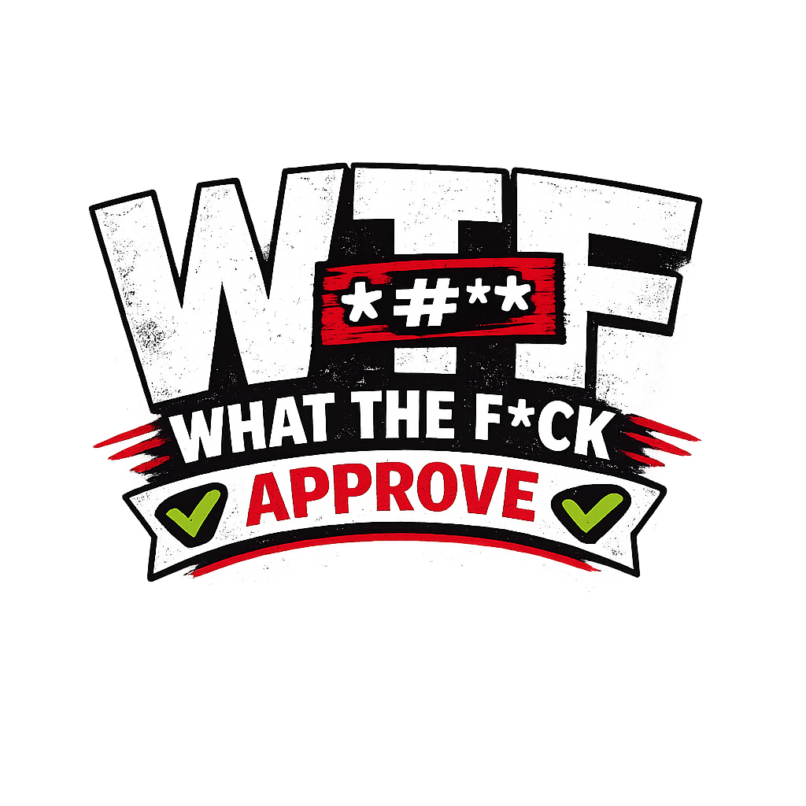
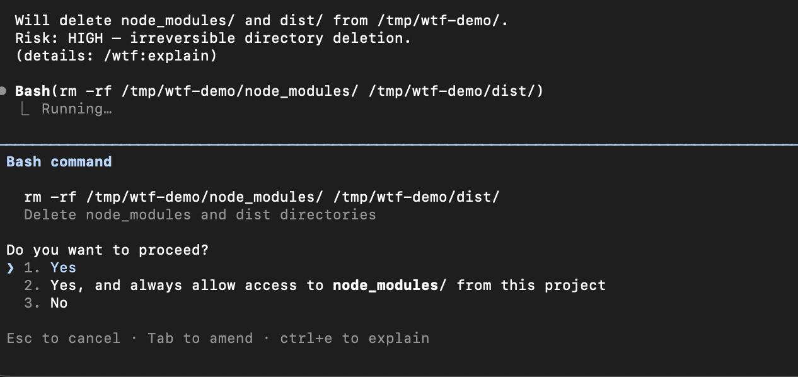

<p align="center">
  
</p>

<h1 align="center">wtf-approve</h1>

<p align="center">
  <a href="https://github.com/Sassine/wtf-approve/actions/workflows/test.yml"></a>
</p>

> Stop blindly approving agent commands. Understand what you're saying yes to.

**wtf-approve** is an open-source [AI skill](https://agentskills.io) that explains agent execution requests in plain language before you approve them. It works with Claude Code, Codex, Gemini CLI, and any agent that supports the skills spec.

## The Problem

AI agents ask you to approve commands like this:

```
find . -name "*.log" -mtime +30 -exec rm {} \; && docker stop $(docker ps -q) && docker system prune -af
```

Most people just hit **Allow**. They shouldn't have to.

## The Solution

With **wtf-approve**, every approval prompt gets a human-readable explanation:

```
Will delete old log files, stop Docker containers, and prune all images/volumes.
Risk: HIGH — file deletion and irreversible Docker prune.
Complex command; summary may omit details.
(details: /wtf:explain)
```

Low-risk commands stay out of the way:

```
3 read-only commands in src/ and package.json. Nothing will be changed.
```

## How It Works

- **Minimal by default** — 1 line for safe commands, 3-4 lines for dangerous ones
- **Risk classification** — low / medium / HIGH based on the action, not context
- **Detail on demand** — type `/wtf:explain` for a per-command breakdown without losing the approval prompt
- **Auto-language** — detects your conversation language. Works in any language the LLM supports
- **Agent-agnostic** — follows the [agentskills.io](https://agentskills.io) spec

## Install

One command. No dependencies.

### Claude Code

```bash
mkdir -p ~/.claude/skills/wtf-approve && curl -sLo ~/.claude/skills/wtf-approve/SKILL.md https://github.com/Sassine/wtf-approve/releases/latest/download/SKILL.md
```

### Codex / Gemini CLI

```bash
mkdir -p ~/.agents/skills/wtf-approve && curl -sLo ~/.agents/skills/wtf-approve/SKILL.md https://github.com/Sassine/wtf-approve/releases/latest/download/SKILL.md
```

## Examples

### Before (what you see today)

```
rm -rf node_modules/ dist/ && curl https://example.com/setup.sh | bash

[Allow]  [Deny]
```

### After (with wtf-approve)

<p align="center">
  
</p>

The explanation appears right above the approval prompt. You see intent and risk before deciding.

### Want more details? Tab to amend

In the approval prompt, press **Tab to amend** and type `/wtf:explain`:

```
Breakdown:
1. rm -rf node_modules/ dist/ — removes two directories. Deletes: node_modules/, dist/. High.
2. curl | bash — downloads and executes remote script. Executes: unaudited remote code. High.
```

The agent responds with a per-command breakdown and re-presents the command for approval.

### More examples

| Command | wtf-approve says |
|---|---|
| `ls -la` | `1 read-only command in the current directory. Nothing will be changed.` |
| `sed -i 's/foo/bar/g' config.json` | `Will edit config.json.` / `Risk: medium — writes to local file.` |
| `curl https://example.com/setup.sh \| bash` | `Will download and execute a remote script.` / `Risk: HIGH — unaudited remote code execution.` |
| `git reset --hard HEAD~3` | `Will discard the last 3 commits permanently.` / `Risk: HIGH — irreversible history rewrite.` |

## Commands

| Command | What it does |
|---|---|
| `/wtf:explain` | Per-command breakdown (Tab to amend in approval prompt) |
| `/wtf:language [code]` | Change language (en, pt-BR, es, ja, etc.) |
| `/wtf:on` | Enable the explainer |
| `/wtf:off` | Disable the explainer |
| `/wtf:config` | Show current settings |

## Risk Levels

| Level | When | Format |
|---|---|---|
| **low** | Read-only, no side effects | 1 line, no hint |
| **medium** | Writes, copies, network reads | 2-3 lines + hint |
| **HIGH** | Deletes, remote exec, sudo, system changes | 3-4 lines + + hint |

Key rule: risk classifies the **action**, never the context. `rm -rf dist/` is always HIGH — doesn't matter if dist/ can be regenerated.

## "But Claude Code already has Ctrl+E..."

Yes — Claude Code has a built-in `Ctrl+E` that toggles a **technical permission explanation** in the approval prompt. It shows which tool is being called and the raw parameters.

**wtf-approve is different.** It translates commands into human intent *before* you even need to ask:

| | Ctrl+E (built-in) | wtf-approve |
|---|---|---|
| **Shows** | Tool name + raw parameters | What it does + what's at risk |
| **Language** | English only | Auto-detects your language |
| **Activation** | Manual shortcut | Automatic on every approval |
| **Audience** | Developers debugging tool calls | Anyone approving commands |

They're complementary. Ctrl+E is debug info. wtf-approve is informed consent.

## Why This Exists

In AI-assisted workflows, users routinely approve commands they don't fully understand. This creates a false sense of control. **wtf-approve** adds a consent layer that translates shell syntax into human intent — so you know what you're approving before you approve it.

This is not a security scanner. It doesn't block or allow anything. It just explains.

## Contributing

PRs welcome. The skill follows the [agentskills.io specification](https://agentskills.io/specification).

## License

MIT

🇧🇷
